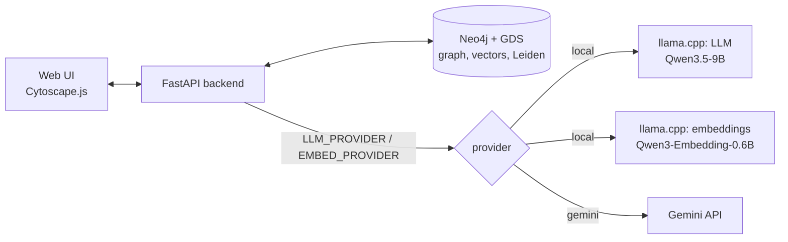
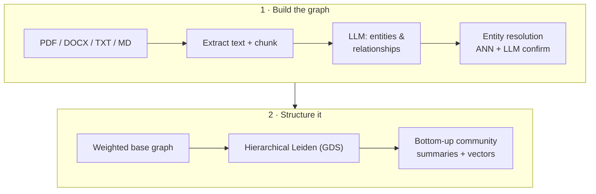
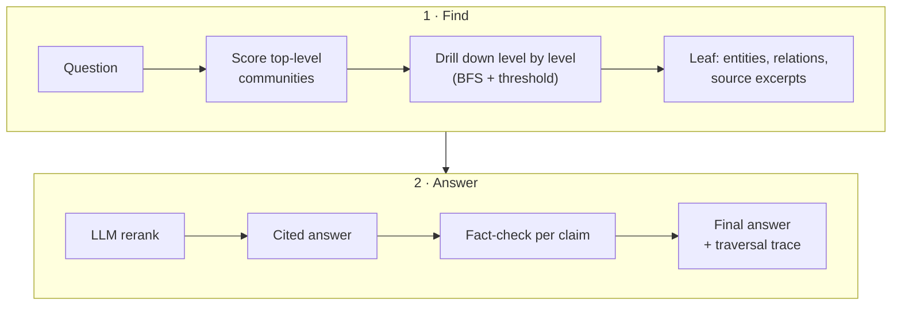

<div align="center">

# GraphRAG

**Hierarchical Graph RAG over your documents — and you can watch the model think.**

Upload a document, get a knowledge graph with multi-level communities, ask questions,
and see exactly which communities and entities the retriever visited, used and cited.


</div>

---

## Highlights

- **Real GraphRAG, not just vectors.** An LLM extracts entities and relationships, duplicates are merged (vector ANN → LLM confirms), and **hierarchical Leiden** (Neo4j GDS) builds communities with LLM-written summaries at every level.
- **Top-down retrieval.** Questions are matched against top-level community summaries, then the retriever **drills down level by level** to leaf communities, pulling entities, relationships and the original source text.
- **Grounded answers.** One rerank pass, then an answer with `[S1]`-style citations, then a **claim-by-claim fact-check** that removes anything the context does not support.
- **Explainable UI.** The traversal is replayed on the graph: scored → visited → accepted / rejected → picked → cited.
- **Local or cloud.** Run fully offline on an NVIDIA GPU with **llama.cpp**, or use **Gemini** — one line in `.env`.
- **One command, fully containerised.** `start.bat` brings up Neo4j, the backend, the UI and (optionally) the local models. Nothing is installed on the host.

---

## Architecture



### Ingestion



### Retrieval



---

## Quick start (Windows)

**Requirements:** Docker Desktop (WSL2 backend). For local models, an NVIDIA GPU with ~10 GB free VRAM and an up-to-date driver.

```powershell
git clone https://github.com/sinaKGT/GraphRAG.git
cd GraphRAG
.\start.bat
```

1. The first run creates `.env` from `.env.example` and opens it. Set `NEO4J_PASSWORD` (at least 8 characters) and pick your providers. A `GEMINI_API_KEY` is only needed if a provider is `gemini`.
2. Run `start.bat` again. With local models, the first start downloads ~6.6 GB once (resumable).
3. The app opens at **http://localhost:8000**. Drop in a document, wait for the progress bar, then ask a question.

Stop with `stop.bat` (your graph and models are kept).

| Service | URL |
|---|---|
| GraphRAG UI | http://localhost:8000 |
| API docs (Swagger) | http://localhost:8000/docs |
| Neo4j Browser | http://localhost:7474 |
| llama.cpp chat (local mode) | http://localhost:8081 |

> **Linux:** `cp .env.example .env`, edit it, then `docker compose --profile local run --rm models-init` and `docker compose --profile local up -d --build`. For Gemini-only (any OS, no GPU needed), leave out `--profile local`.

---

## Using the UI

| Panel | What you can do |
|---|---|
| **Documents** (left) | Drag & drop files, follow ingestion progress, reset the graph |
| **Graph** (centre) | Entities coloured by type, community hubs sized by level. Click any node for its description or summary |
| **Ask** (right) | Ask a question (`Ctrl+Enter`). Click a citation such as `[S1]` to read the source text and jump to its nodes |

**Traversal colours:** <kbd>amber</kbd> scored / visited · <kbd>green</kbd> accepted · <kbd>grey</kbd> rejected / dropped · <kbd>cyan</kbd> entity picked · <kbd>pink</kbd> cited in the answer.
The *Traversal* list shows every relevance score, which makes tuning `RETRIEVAL_THRESHOLD` easy.

---

## Models

| Mode | LLM | Embeddings | Notes |
|---|---|---|---|
| **Local** (default) | Qwen3.5-9B `UD-Q4_K_XL` (6 GB) | Qwen3-Embedding-0.6B `Q8_0` (1024-d) | Fits entirely in 16 GB VRAM; JSON-schema-constrained output |
| Local (larger) | Qwen3.6-35B-A3B `UD-Q4_K_XL` (22 GB, MoE) | same | Higher quality; split across VRAM and RAM, so slower |
| **Gemini** | `gemini-3.8-flash` | `gemini-embedding-001` (768-d) | Free tier works (built-in rate limiting and retry) |

> Switching the **embedding** provider changes the vector space. The graph records which embedding model built it and refuses to mix them: reset the graph after switching.

<details>
<summary><b>Configuration reference (<code>.env</code>)</b></summary>

| Variable | Default | Purpose |
|---|---|---|
| `LLM_PROVIDER` / `EMBED_PROVIDER` | `local` | `local` (llama.cpp) or `gemini` |
| `GEMINI_API_KEY` | — | Only for Gemini |
| `NEO4J_PASSWORD` | — | At least 8 characters; stored by Neo4j on first start |
| `LOCAL_LLM_REPO` / `LOCAL_LLM_FILE` | Qwen3.5-9B | Any GGUF on Hugging Face |
| `LLM_CONCURRENCY` | `2` | Parallel LLM calls (= llama.cpp slots) |
| `CHUNK_SIZE_CHARS` | `4000` | ~1000 tokens per chunk |
| `ER_COSINE_THRESHOLD` | local `0.70` / gemini `0.85` | Similarity for duplicate candidates |
| `LEIDEN_GAMMA` | `1.0` | Higher means smaller, more numerous communities |
| `RETRIEVAL_THRESHOLD` | local `0.50` / gemini `0.55` | Score needed to accept or descend into a community |
| `CONTEXT_MAX_CHARS` | `30000` | Context budget sent to the LLM |

See [`.env.example`](.env.example) for the full list.
</details>

<details>
<summary><b>Graph model</b></summary>

```
(:Document)<-[:PART_OF]-(:Chunk)-[:MENTIONS]->(:Entity)
(:Entity)-[:RELATED {type, weight}]->(:Entity)
(:Entity)-[:IN_COMMUNITY]->(:Community {level, title, summary, embedding})
(:Community)-[:CHILD_OF]->(:Community)
(:Alias)-[:ALIAS_OF]->(:Entity)          // names merged by entity resolution
```
</details>

<details>
<summary><b>API</b></summary>

| Method | Endpoint | Description |
|---|---|---|
| `POST` | `/api/documents` | Upload a file; returns a background job |
| `GET` | `/api/jobs/{id}` | Ingestion progress |
| `POST` | `/api/query` | `{"question": "..."}` → answer, fact-check, citations, traversal trace |
| `GET` | `/api/graph` | Entities, communities and edges for visualisation |
| `GET` | `/api/stats` · `/api/health` | Graph counts · status of Neo4j, LLM and embeddings |
| `POST` | `/api/communities/rebuild` | Re-run Leiden and summaries (cached summaries are reused) |
| `DELETE` | `/api/graph` | Reset everything |

Interactive docs: http://localhost:8000/docs
</details>

<details>
<summary><b>Project structure</b></summary>

```
├── backend/app/
│   ├── ingest/        text.py · extraction.py · graph.py · communities.py · pipeline.py
│   ├── retrieval/     engine.py  (BFS drill-down, rerank, answer, fact-check, trace)
│   ├── llm.py         Gemini + llama.cpp backends behind one interface
│   ├── db.py          Neo4j schema, vector indexes, embedding-space guard
│   ├── prompts.py     all prompts + structured-output schemas
│   └── main.py        FastAPI routes
├── frontend/          index.html · app.js · style.css · vendor/ (Cytoscape.js, MIT)
├── docker-compose.yml neo4j · backend · models-init · embed · llm
├── start.bat / stop.bat
└── .env.example
```
</details>

<details>
<summary><b>Troubleshooting</b></summary>

| Symptom | Fix |
|---|---|
| Neo4j container "unhealthy" | `NEO4J_PASSWORD` is shorter than 8 characters. Fix it, then run `docker compose down -v` |
| Local model very slow (~25 tok/s prompt processing) | Another app (e.g. LM Studio) is holding VRAM. Close it, then `docker compose restart llm` |
| llm container exits with code 137 | Not enough RAM for Docker. Add `memory=24GB` under `[wsl2]` in `%UserProfile%\.wslconfig`, then `wsl --shutdown` |
| "Graph was built with embeddings …" | You switched embedding provider or size. Reset the graph in the UI |
| Ingestion seems stuck | Check `docker compose logs llm`; while the model loads, jobs wait and retry automatically |
</details>

---

## Security

- Secrets live only in `.env`, which is git-ignored and excluded from Docker build contexts.
- All ports are bound to `127.0.0.1`, so nothing is exposed to your network.

## License

[MIT](LICENSE) © 2026 Sina Khoshgoftar. Vendored front-end libraries (Cytoscape.js, cytoscape-fcose, cose-base, layout-base) are MIT, with their licences in [`frontend/vendor/licenses/`](frontend/vendor/licenses/).
